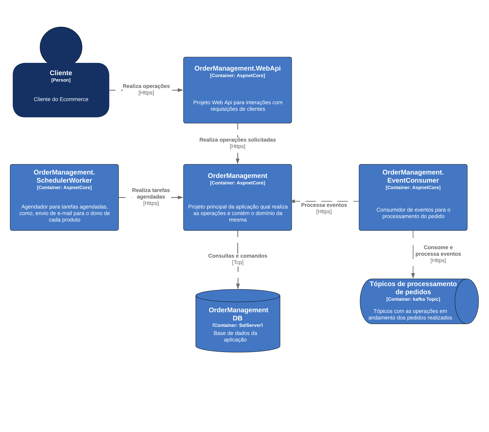
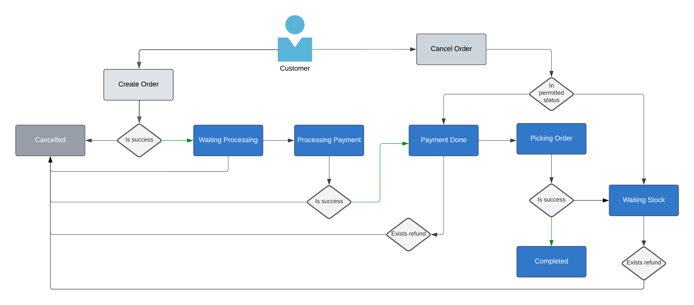

# eCommerce Order Management

Repositório para o desafio final do treinamento **C# do jeito certo**, apresentado pela Eximia na Bem.

## Proposta do Projeto

O desafio consiste em desenvolver um sistema gerenciador de pedidos para e-commerce, com foco em escalabilidade, manutenibilidade e boas práticas de desenvolvimento.

## Estrutura do Projeto

O sistema foi projetado com uma arquitetura modular, onde o projeto principal se conecta ao banco de dados e encapsula o domínio da aplicação. A estrutura é composta pelos seguintes módulos:

- **EcommerceOrderManagement**: Projeto principal que contém a lógica de domínio e interações com o banco de dados.
- **EcommerceOrderManagement.WebApi**: Projeto de API Web responsável pelas interações com os pedidos dos clientes.
- **EcommerceOrderManagement.EventConsumer**: Projeto consumidor de eventos Kafka para processamento assíncrono dos pedidos.
- **EcommerceOrderManagement.SchedulerWorker**: Projeto de agendador que executa tarefas programadas, como o envio de e-mails para os proprietários dos produtos.

### Diagramas

- **C4 da Aplicação**  
  

- **Diagrama de Estados dos Pedidos**  
  

## Como Executar o Projeto

Para rodar o projeto localmente, siga os passos abaixo:

1. Navegue até a pasta `src`:  
``cd src``

2. Execute o comando abaixo para iniciar os serviços com Docker Compose:  
```docker compose up -d```

3. Após iniciar os serviços, atualize o banco de dados utilizando o Entity Framework Core:  
```dotnet ef database update```


## Como executar os testes

Para rodar os testes localmente, siga os passos abaixo:

1. Navegue até a pasta ` cd tests/EcommerceOrderManagement.Tests`:  
   `` cd tests/EcommerceOrderManagement.Tests`` 

2. Rode os testes:  
   ```dotnet test```

### Contribuição
Sinta-se à vontade para contribuir com melhorias, correções ou sugestões. Todas as contribuições são bem-vindas!